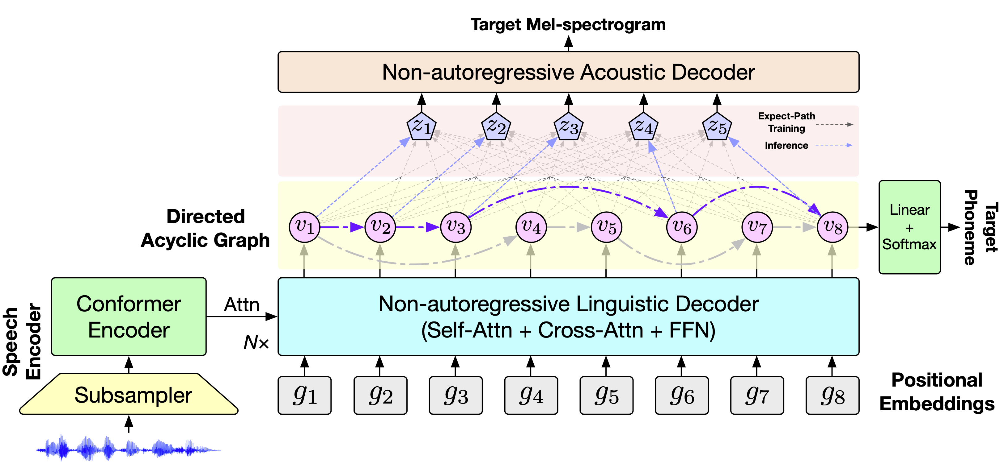

# DASpeech

**Qingkai Fang, Yan Zhou, Yang Feng\* | Institute of Computing Technology, Chinese Academy of Sciences (ICT/CAS)**

This is the PyTorch implementation of the **NeurIPS 2023** paper [DASpeech: Directed Acyclic Transformer for Fast and High-quality Speech-to-Speech Translation](https://arxiv.org/abs/2310.07403).

**Abstract**: DASpeech is a non-autoregressive direct S2ST model which realizes both *fast* and *high-quality* S2ST. To better capture the multimodal distribution of the target speech, DASpeech adopts the two-pass architecture to decompose the generation process into two steps, where a linguistic decoder first generates the target text, and an acoustic decoder then generates the target speech based on the hidden states of the linguistic decoder. Specifically, we use the decoder of DA-Transformer as the linguistic decoder, and use FastSpeech 2 as the acoustic decoder. DA-Transformer models translations with a directed acyclic graph (DAG). To consider all potential paths in the DAG during training, we calculate the expected hidden states for each target token via dynamic programming, and feed them into the acoustic decoder to predict the target mel-spectrogram. During inference, we select the most probable path and take hidden states on that path as input to the acoustic decoder. DASpeech successfully achieves both high-quality translations and fast decoding speeds for S2ST.

**Audio samples are available at [https://ictnlp.github.io/daspeech-demo/](https://ictnlp.github.io/daspeech-demo/)**.




## 🔥 News

- **[2024/07] We released the DASpeech model trained on the CVSS Fr-En dataset. You can download it via [this link]([https://drive.google.com/file/d/1ffBgumut9I3Rnb10QOrZOZu8vyZd_0lQ/view](https://drive.google.com/drive/folders/1VlJeCHouxj0OxsP060pLYLud1cqkSTso?usp=drive_link)).**

- **[2024/01] We have preliminarily released the data processing scripts because many people are in need. Please refer to the [documentation](https://github.com/ictnlp/DASpeech/blob/main/DATA_PREPARE.md). We are currently working on a more concise version and plan to release it as soon as possible.**


## DASpeech files

We provide the fairseq plugins in the directory `DASpeech/`, some of them (`custom_ops/`, `nat_dag_loss.py`) are copied from the [original DA-Transformer](https://github.com/thu-coai/DA-Transformer).

```
DASpeech
├── __init__.py
├── criterions
│   ├── __init__.py
│   ├── nat_dag_loss.py                     ## DA-Transformer loss
│   ├── s2s_dag_fastspeech2_loss.py         ## DASpeech loss
│   └── utilities.py
├── custom_ops                              ## CUDA implementations
│   ├── __init__.py
│   ├── dag_best_alignment.cu
│   ├── dag_loss.cpp
│   ├── dag_loss.cu
│   ├── dag_loss.py
│   ├── logsoftmax_gather.cu
│   └── utilities.h
├── datasets
│   ├── __init__.py
│   ├── nat_speech_to_speech_data_cfg.py
│   ├── nat_speech_to_speech_dataset.py     ## NAR S2ST dataset
│   └── nat_speech_to_text_dataset.py       ## NAR S2TT dataset
├── generator
│   ├── __init__.py
│   ├── generate_features.py                ## Generation scripts
│   ├── s2s_nat_generator.py                ## NAR S2ST generator
│   ├── s2t_nat_generator.py                ## NAR S2TT generator
│   └── speech_generator_modified.py
├── models
│   ├── __init__.py
│   ├── fastspeech2_noemb.py
│   ├── s2s_conformer_dag_fastspeech2.py    ## DASpeech model
│   ├── s2t_conformer_dag.py                ## S2TT DA-Transformer model
│   └── s2t_conformer_nat.py
└── tasks
    ├── __init__.py
    ├── nat_speech_to_speech.py             ## NAR S2ST task
    └── nat_speech_to_text.py               ## NAR S2TT task
```


## Requirements & Installation

- python >= 3.8
- pytorch == 1.13.1 (cuda == 11.3)
- torchaudio == 0.13.1
- gcc >= 7.0.0
- Install fairseq via `pip install -e fairseq/`.


## Data Preparation

1. Download the [CVSS Dataset](https://github.com/google-research-datasets/cvss).
2. Extract the mel-filterbank features of the source speech.
3. Perform forced alignment for the target speech using [Montreal Forced Aligner](https://mfa-models.readthedocs.io/en/latest/#). From the alignment results, we can obtain the target phoneme sequence and durations of each phoneme.
4. Extract the mel-spectrogram, as well as the pitch and energy information of the target speech.
5. Format the data as follows:

**[Speech-to-Text Translation Data]** 

Training data for the `S2TT DA-Transformer` should be like this:

```
id	audio	n_frames	tgt_text	speaker
common_voice_fr_17732749	data/cvss-c/x-en/src_fbank80.zip:152564:126208	394	M AE1 D AH0 M spn DH AH0 B EH1 R AH0 N IH0 S	None
common_voice_fr_17732750	data/cvss-c/x-en/src_fbank80.zip:112447740355:226048	706	Y UW1 N OW1 EH1 Z W EH1 L EH1 Z AY1 D UW1 DH AE1 T M EH1 N IY0 N UW1 M AA1 L AH0 K Y UW2 L Z AE1 V AH0 N F AO1 R CH AH0 N AH0 T L IY0 B IH1 N D IH2 S AH0 P OY1 N T IH0 NG	None
common_voice_fr_17732751	data/cvss-c/x-en/src_fbank80.zip:117843863169:129408	404	OW1 B IH0 K AH1 Z N AW1 HH W EH1 N W IY1 T AO1 K AH0 B AW1 T D R IH1 NG K IH0 NG AY1 L IY1 V	None
...
```

The configuration file `config.yaml` should be like this:

```
input_channels: 1
input_feat_per_channel: 80
specaugment:
  freq_mask_F: 27
  freq_mask_N: 1
  time_mask_N: 1
  time_mask_T: 100
  time_mask_p: 1.0
  time_wrap_W: 0
transforms:
  '*':
  - utterance_cmvn
  _train:
  - utterance_cmvn
  - specaugment
vocab_filename: vocab.txt
```

**[Text-to-Speech Data]** 

Training data for the `FastSpeech 2` should be like this:

```
id	audio	n_frames	tgt_text	speaker	src_text	duration	pitch	energy
common_voice_fr_17732749	data/cvss-c/fr-en/tts/logmelspec80.zip:9649913382:42048	131	M AE1 D AH0 M spn DH AH0 B EH1 R AH0 N IH0 S	None	madam pfeffers the baroness	6 10 3 6 7 41 1 4 6 8 6 4 4 8 17	data/cvss-c/fr-en/tts/pitch.zip:56518652:248	data/cvss-c/fr-en/tts/energy.zip:39972962:188
common_voice_fr_17732750	data/cvss-c/fr-en/tts/logmelspec80.zip:9565416692:131328	410	Y UW1 N OW1 EH1 Z W EH1 L EH1 Z AY1 D UW1 DH AE1 T M EH1 N IY0 N UW1 M AA1 L AH0 K Y UW2 L Z AE1 V AH0 N F AO1 R CH AH0 N AH0 T L IY0 B IH1 N D IH2 S AH0 P OY1 N T IH0 NG	None	you know as well as i do that many new molecules have unfortunately been disappointing	10 4 6 15 6 7 5 6 7 5 6 14 8 20 12 12 4 15 6 3 8 5 34 13 5 3 3 7 4 2 3 3 3 3 2 6 11 4 6 9 4 3 5 3 4 7 7 5 5 5 3 6 5 8 9 4 5 7 10	data/cvss-c/fr-en/tts/pitch.zip:56028170:600	data/cvss-c/fr-en/tts/energy.zip:39626736:364
common_voice_fr_17732751	data/cvss-c/fr-en/tts/logmelspec80.zip:6059194182:112128	350	OW1 B IH0 K AH1 Z N AW1 HH W EH1 N W IY1 T AO1 K AH0 B AW1 T D R IH1 NG K IH0 NG AY1 L IY1 V	None	oh because now when we talk about drinking i leave	31 24 5 8 10 8 6 31 26 5 4 5 4 6 11 10 7 3 5 9 5 6 3 5 4 7 7 11 41 10 22 11	data/cvss-c/fr-en/tts/pitch.zip:35504944:384	data/cvss-c/fr-en/tts/energy.zip:25110282:256
...
```

The configuration file `config.yaml` should be like this:

```
features:
  energy_max: 5.70564079284668
  energy_min: 1.0e-08
  eps: 1.0e-05
  f_max: 8000
  f_min: 20
  hop_len_t: 0.011609977324263039
  hop_length: 256
  n_fft: 1024
  n_mels: 80
  n_stft: 513
  pitch_max: 6.611038927172726
  pitch_min: 1.0e-08
  sample_rate: 22050
  type: spectrogram+melscale+log
  win_len_t: 0.046439909297052155
  win_length: 1024
  window_fn: hann
global_cmvn:
  stats_npz_path: data/cvss-c/fr-en/tts/gcmvn_stats.npz
sample_rate: 22050
transforms:
  '*':
  - global_cmvn
vocab_filename: vocab.txt
```

**[Speech-to-Speech Translation Data]** 

Training data for the `DASpeech` should be like this:

```
id	src_audio	src_n_frames	tgt_text	tgt_audio	tgt_n_frames	duration	pitch	energy
common_voice_fr_17732749	data/cvss-c/x-en/src_fbank80.zip:152564:126208	394	M AE1 D AH0 M spn DH AH0 B EH1 R AH0 N IH0 S	data/cvss-c/fr-en/tts/logmelspec80.zip:9649913382:42048	131	6 10 3 6 7 41 1 4 6 8 6 4 4 8 17	data/cvss-c/fr-en/tts/pitch.zip:56518652:248	data/cvss-c/fr-en/tts/energy.zip:39972962:188
common_voice_fr_17732750	data/cvss-c/x-en/src_fbank80.zip:112447740355:226048	706	Y UW1 N OW1 EH1 Z W EH1 L EH1 Z AY1 D UW1 DH AE1 T M EH1 N IY0 N UW1 M AA1 L AH0 K Y UW2 L Z AE1 V AH0 N F AO1 R CH AH0 N AH0 T L IY0 B IH1 N D IH2 S AH0 P OY1 N T IH0 NG	data/cvss-c/fr-en/tts/logmelspec80.zip:9565416692:131328	410	10 4 6 15 6 7 5 6 7 5 6 14 8 20 12 12 4 15 6 3 8 5 34 13 5 3 3 7 4 2 3 3 3 3 2 6 11 4 6 9 4 3 5 3 4 7 7 5 5 5 3 6 5 8 9 4 5 7 10	data/cvss-c/fr-en/tts/pitch.zip:56028170:600	data/cvss-c/fr-en/tts/energy.zip:39626736:364
common_voice_fr_17732751	data/cvss-c/x-en/src_fbank80.zip:117843863169:129408	404	OW1 B IH0 K AH1 Z N AW1 HH W EH1 N W IY1 T AO1 K AH0 B AW1 T D R IH1 NG K IH0 NG AY1 L IY1 V	data/cvss-c/fr-en/tts/logmelspec80.zip:6059194182:112128	350	31 24 5 8 10 8 6 31 26 5 4 5 4 6 11 10 7 3 5 9 5 6 3 5 4 7 7 11 41 10 22 11	data/cvss-c/fr-en/tts/pitch.zip:35504944:384	data/cvss-c/fr-en/tts/energy.zip:25110282:256
...
```

The configuration file `config.yaml` should be like this:

```
# source audio
input_channels: 1
input_feat_per_channel: 80
specaugment:
  freq_mask_F: 27
  freq_mask_N: 1
  time_mask_N: 1
  time_mask_T: 100
  time_mask_p: 1.0
  time_wrap_W: 0
source_transforms:
  '*':
  - utterance_cmvn
  _train:
  - utterance_cmvn
  - specaugment
# target audio
features:
  energy_max: 5.70564079284668
  energy_min: 1.0e-08
  eps: 1.0e-05
  f_max: 8000
  f_min: 20
  hop_len_t: 0.011609977324263039
  hop_length: 256
  n_fft: 1024
  n_mels: 80
  n_stft: 513
  pitch_max: 6.611038927172726
  pitch_min: 1.0e-08
  sample_rate: 22050
  type: spectrogram+melscale+log
  win_len_t: 0.046439909297052155
  win_length: 1024
  window_fn: hann
global_cmvn:
  stats_npz_path: data/cvss-c/fr-en/tts/gcmvn_stats.npz
sample_rate: 22050
target_transforms:
  '*':
  - global_cmvn
# vocab
vocab_filename: vocab.txt
```


## Model Training

We takes CVSS-C Fr-En as an example. All models are trained on 4 RTX 3090 GPUs. You can adjust the `--update-freq` depending on the number of your available GPUs.

### 1. S2TT DA-Tranformer Pretraining

```shell
fairseq-train data/cvss-c/fr-en/fbank2phone \
    --user-dir DASpeech \
    --config-yaml config.yaml \
    --task nat_speech_to_text --noise full_mask \
    --arch s2t_conformer_dag --share-decoder-input-output-embed \
    --pos-enc-type rel_pos --decoder-learned-pos --attn-type espnet \
    --activation-fn gelu --apply-bert-init \
    --encoder-layers 12 --encoder-embed-dim 256 --encoder-ffn-embed-dim 2048 --encoder-attention-heads 4 \
    --decoder-layers 4 --decoder-embed-dim 512 --decoder-ffn-embed-dim 2048 --decoder-attention-heads 8 \
    --links-feature feature:position --decode-strategy lookahead \
    --max-source-positions 6000 --max-target-positions 1024 --src-upsample-scale 0.5 \
    --criterion nat_dag_loss \
    --max-transition-length 99999 \
    --glat-p 0.5:0.1@100k --glance-strategy number-random \
    --optimizer adam --adam-betas '(0.9,0.999)' --fp16 \
    --label-smoothing 0.0 --weight-decay 0.01 --dropout 0.1 --attention-dropout 0.1 --relu-dropout 0.1 \
    --lr-scheduler inverse_sqrt  --warmup-updates 10000 \
    --clip-norm 1.0 --lr 0.0005 --warmup-init-lr 1e-7 --stop-min-lr 1e-9 \
    --ddp-backend=legacy_ddp \
    --max-tokens 40000 --update-freq 2 --grouped-shuffling \
    --max-update 100000 --max-tokens-valid 20000 \
    --save-interval 1 --save-interval-updates 2000 \
    --seed 1 \
    --train-subset train --valid-subset dev \
    --validate-interval 1000 --validate-interval-updates 2000 \
    --eval-bleu --eval-bleu-args '{"iter_decode_max_iter": 0, "iter_decode_with_beam": 1}' \
    --eval-bleu-print-samples \
    --best-checkpoint-metric bleu --maximize-best-checkpoint-metric \
    --save-dir checkpoints/cvss-c.fr-en.da-transformer \
    --keep-best-checkpoints 5 \
    --keep-interval-updates 5 --keep-last-epochs 5 \
    --no-progress-bar --log-format json --log-interval 100 \
    --num-workers 0
```

### 2. FastSpeech 2 Pretraining

```shell
fairseq-train data/cvss-c/fr-en/tts/ \
    --config-yaml config.yaml --train-subset train --valid-subset dev \
    --num-workers 0 --max-sentences 64 --max-update 100000 \
    --task text_to_speech --criterion fastspeech2 --arch fastspeech2 \
    --encoder-layers 4 --encoder-embed-dim 256 --encoder-attention-heads 4 \
    --decoder-layers 4 --decoder-embed-dim 256 --decoder-attention-heads 4 \
    --fft-hidden-dim 1024 \
    --clip-norm 5.0 --n-frames-per-step 1 \
    --dropout 0.1 --attention-dropout 0.1 \
    --optimizer adam --lr 5e-4 --lr-scheduler inverse_sqrt --warmup-updates 4000 --fp16 \
    --no-progress-bar --log-format json --log-interval 100 \
    --required-batch-size-multiple 1 \
    --save-interval 1 --save-interval-updates 2000 \
    --validate-interval 1000 --validate-interval-updates 2000 \
    --save-dir checkpoints/cvss-c.fr-en.fastspeech2 \
    --keep-best-checkpoints 5 \
    --keep-interval-updates 5 --keep-last-epochs 5 \
    --seed 1 --update-freq 2
```

### 3. DASpeech finetuning

```shell
fairseq-train data/cvss-c/fr-en/nat_s2s \
    --user-dir DASpeech \
    --config-yaml config.yaml \
    --task nat_speech_to_speech --noise full_mask \
    --arch s2s_conformer_dag_fastspeech2 --share-decoder-input-output-embed \
    --pos-enc-type rel_pos --decoder-learned-pos --attn-type espnet \
    --activation-fn gelu --apply-bert-init \
    --encoder-layers 12 --encoder-embed-dim 256 --encoder-ffn-embed-dim 2048 --encoder-attention-heads 4 \
    --decoder-layers 4 --decoder-embed-dim 512 --decoder-ffn-embed-dim 2048 --decoder-attention-heads 8 \
    --tts-encoder-layers 4 --tts-encoder-embed-dim 256 --tts-encoder-attention-heads 4 \
    --tts-decoder-layers 4 --tts-decoder-embed-dim 256 --tts-decoder-attention-heads 4 \
    --fft-hidden-dim 1024 --adaptor-ffn-dim 1024 \
    --n-frames-per-step 1 \
    --links-feature feature:position --decode-strategy lookahead \
    --max-source-positions 6000 --max-target-positions 1024 --max-target-audio-positions 1200 --src-upsample-scale 0.5 \
    --criterion s2s_dag_fastspeech2_loss --training-strategy expect --tts-loss-weight 5.0 \
    --max-transition-length 99999 \
    --glat-p 0.1:0.1@50k --glance-strategy number-random \
    --optimizer adam --adam-betas '(0.9,0.999)' --fp16 \
    --label-smoothing 0.0 --weight-decay 0.01 --dropout 0.1 --attention-dropout 0.1 --relu-dropout 0.1 \
    --lr-scheduler inverse_sqrt  --warmup-updates 4000 \
    --clip-norm 1.0 --lr 0.001 --warmup-init-lr 1e-7 --stop-min-lr 1e-9 \
    --ddp-backend=legacy_ddp \
    --max-tokens 20000 --update-freq 4 --grouped-shuffling \
    --max-update 50000 --max-tokens-valid 20000 \
    --save-interval 1 --save-interval-updates 2000 \
    --seed 1 \
    --train-subset train --valid-subset dev \
    --validate-interval 1000 --validate-interval-updates 2000 \
    --save-dir checkpoints/cvss-c.fr-en.daspeech \
    --keep-last-epochs 10 \
    --no-progress-bar --log-format json --log-interval 100 \
    --load-pretrained-dag-from checkpoints/cvss-c.fr-en.da-transformer/average_best_checkpoint.pt \
    --load-pretrained-fastspeech-from checkpoints/cvss-c.fr-en.fastspeech2/average_best_checkpoint.pt \
    --num-workers 0
```

## Multilingual Setting (CVSS-C X-En many-to-one S2ST training)

In the multilingual setting we adopt a **two-stage S2TT pretraining strategy**. Initially, we pretrain the speech encoder and the linguistic decoder using the **speech-to-subword** task, followed by pretraining on the **speech-to-phoneme** task. In the second stage of pretraining, the embedding and output projection matrices of the decoder are replaced and trained from scratch to accommodate changes in the vocabulary.

The script for the two-stage S2TT pretraining is below:

```shell
# speech-to-subword pretrain
fairseq-train data/cvss-c/x-en/fbank2text \
    --user-dir DASpeech \
    --config-yaml config.yaml \
    --task nat_speech_to_text --noise full_mask \
    --arch s2t_conformer_dag --share-decoder-input-output-embed \
    --pos-enc-type rel_pos --decoder-learned-pos --attn-type espnet \
    --activation-fn gelu --apply-bert-init \
    --encoder-layers 12 --encoder-embed-dim 256 --encoder-ffn-embed-dim 2048 --encoder-attention-heads 4 \
    --decoder-layers 4 --decoder-embed-dim 512 --decoder-ffn-embed-dim 2048 --decoder-attention-heads 8 \
    --links-feature feature:position --decode-strategy lookahead \
    --max-source-positions 6000 --max-target-positions 1024 --src-upsample-scale 0.5 \
    --criterion nat_dag_loss \
    --max-transition-length 99999 \
    --glat-p 0.5:0.1@100k --glance-strategy number-random \
    --optimizer adam --adam-betas '(0.9,0.999)' --fp16 \
    --label-smoothing 0.0 --weight-decay 0.01 --dropout 0.1 --attention-dropout 0.1 --relu-dropout 0.1 \
    --lr-scheduler inverse_sqrt  --warmup-updates 10000 \
    --clip-norm 1.0 --lr 0.0005 --warmup-init-lr 1e-7 --stop-min-lr 1e-9 \
    --ddp-backend=legacy_ddp \
    --max-tokens 40000 --update-freq 2 --grouped-shuffling \
    --max-update 100000 --max-tokens-valid 20000 \
    --save-interval 1 --save-interval-updates 2000 \
    --seed 1 \
    --train-subset train --valid-subset dev \
    --validate-interval 1000 --validate-interval-updates 2000 \
    --eval-bleu --eval-bleu-args '{"iter_decode_max_iter": 0, "iter_decode_with_beam": 1}' \
    --eval-bleu-print-samples \
    --best-checkpoint-metric bleu --maximize-best-checkpoint-metric \
    --save-dir checkpoints/cvss-c.x-en.da-transformer.subword \
    --keep-best-checkpoints 5 \
    --keep-interval-updates 5 --keep-last-epochs 5 \
    --no-progress-bar --log-format json --log-interval 100 \
    --num-workers 0
# speech-to-phoneme pretrain
fairseq-train data/cvss-c/x-en/fbank2phone \
    --user-dir DASpeech \
    --config-yaml config.yaml \
    --task nat_speech_to_text --noise full_mask \
    --arch s2t_conformer_dag --share-decoder-input-output-embed \
    --pos-enc-type rel_pos --decoder-learned-pos --attn-type espnet \
    --activation-fn gelu --apply-bert-init \
    --encoder-layers 12 --encoder-embed-dim 256 --encoder-ffn-embed-dim 2048 --encoder-attention-heads 4 \
    --decoder-layers 4 --decoder-embed-dim 512 --decoder-ffn-embed-dim 2048 --decoder-attention-heads 8 \
    --links-feature feature:position --decode-strategy lookahead \
    --max-source-positions 6000 --max-target-positions 1024 --src-upsample-scale 0.5 \
    --criterion nat_dag_loss \
    --max-transition-length 99999 \
    --glat-p 0.5:0.1@100k --glance-strategy number-random \
    --optimizer adam --adam-betas '(0.9,0.999)' --fp16 \
    --label-smoothing 0.0 --weight-decay 0.01 --dropout 0.1 --attention-dropout 0.1 --relu-dropout 0.1 \
    --lr-scheduler inverse_sqrt  --warmup-updates 10000 \
    --clip-norm 1.0 --lr 0.0005 --warmup-init-lr 1e-7 --stop-min-lr 1e-9 \
    --ddp-backend=legacy_ddp \
    --max-tokens 40000 --update-freq 2 --grouped-shuffling \
    --max-update 100000 --max-tokens-valid 20000 \
    --save-interval 1 --save-interval-updates 2000 \
    --seed 1 \
    --train-subset train --valid-subset dev \
    --validate-interval 1000 --validate-interval-updates 2000 \
    --eval-bleu --eval-bleu-args '{"iter_decode_max_iter": 0, "iter_decode_with_beam": 1}' \
    --eval-bleu-print-samples \
    --best-checkpoint-metric bleu --maximize-best-checkpoint-metric \
    --save-dir checkpoints/cvss-c.x-en.da-transformer.phoneme \
    --keep-best-checkpoints 5 \
    --keep-interval-updates 5 --keep-last-epochs 5 \
    --no-progress-bar --log-format json --log-interval 100 \
    --load-pretrained-dag-from checkpoints/cvss-c.x-en.da-transformer.subword/average_best_checkpoint.pt \
    --num-workers 0
```


## Evaluation

The evaluation process consists of the following steps:

1. Average the last 5 checkpoints.
2. Generate the target mel-spectrogram with *Lookahead* or *Joint-Viterbi* decoding.
3. Convert the mel-spectrogram into waveform with [HiFi-GAN](https://github.com/jik876/hifi-gan) VCTK_V1 vocoder (Please download the model and configuration file to `hifi-gan/VCTK_V1` directory).
4. Compute the ASR-BLEU score.

We provide the evaluation scripts in `test_scripts/`. You can just run:

```shell
sh test_scripts/generate.fr-en.lookahead.vctk.sh cvss-c.fr-en.daspeech
```

For *Joint-Viterbi* decoding, please select the value of parameter $\beta$ according to the performance on the `dev` set.


## Citation

If this repository is useful for you, please cite as:

```
@inproceedings{fang-etal-2023-daspeech,
    title={{DAS}peech: Directed Acyclic Transformer for Fast and High-quality Speech-to-Speech Translation},
    author={Fang, Qingkai and Zhou, Yan and Feng, Yang},
    booktitle={Advances in Neural Information Processing Systems},
    year={2023},
}
```
